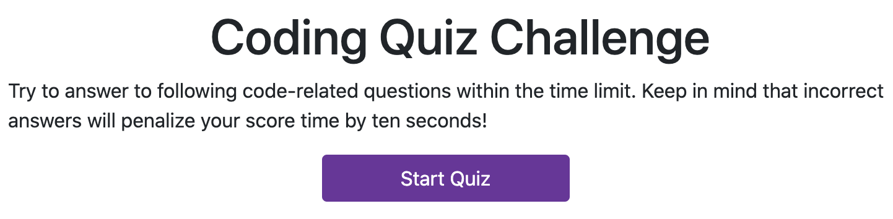

# Code Quiz

The website that I created features a quiz on JavaScript fundamentals. The structure of the quiz is based on a game format where the user answers questions and is given a score depending on completion time. For every correct answer the timer remains unchanged and for every incorrect answer 10 seconds are deducted from the timer. The scores are logged on a high scores page. 



The basic page navigation uses JavaScript DOM manipulation to dynamically change the page html. The following code snippet shows a basic example of how the final score page is triggered by the scoreEl button tag:
```
scoreEl.addEventListener("click", function() {
  scorePage();
})
```
The questions and answers are stored as an array of objects, making it possible to iterate over the array to dynamically generate the question/answer pairs: 
```
var quizData = [
  {
    question: "Commonly used data types DO NOT include:",
    answers: ["1. strings", "2. booleans", "3. alerts", "4. numbers"],
    correctAnswer: "3. alerts",
  },
];
```

Once the quiz is over the time left is used as a score and is logged in local storage using ```JSON.stringify()``` and ```JSON.parse()```. 

## Usage
The website can be found in the following link:

[Code Quiz](https://dgtlctzn.github.io/code-quiz/)

## Credits
Special thanks to GA Tech Bootcamp for providing the necessary materials and information.

## License
MIT License

Copyright (c) 2020 Joseph Perry

Permission is hereby granted, free of charge, to any person obtaining a copy
of this software and associated documentation files (the "Software"), to deal
in the Software without restriction, including without limitation the rights
to use, copy, modify, merge, publish, distribute, sublicense, and/or sell
copies of the Software, and to permit persons to whom the Software is
furnished to do so, subject to the following conditions:

The above copyright notice and this permission notice shall be included in all
copies or substantial portions of the Software.

THE SOFTWARE IS PROVIDED "AS IS", WITHOUT WARRANTY OF ANY KIND, EXPRESS OR
IMPLIED, INCLUDING BUT NOT LIMITED TO THE WARRANTIES OF MERCHANTABILITY,
FITNESS FOR A PARTICULAR PURPOSE AND NONINFRINGEMENT. IN NO EVENT SHALL THE
AUTHORS OR COPYRIGHT HOLDERS BE LIABLE FOR ANY CLAIM, DAMAGES OR OTHER
LIABILITY, WHETHER IN AN ACTION OF CONTRACT, TORT OR OTHERWISE, ARISING FROM,
OUT OF OR IN CONNECTION WITH THE SOFTWARE OR THE USE OR OTHER DEALINGS IN THE
SOFTWARE. 